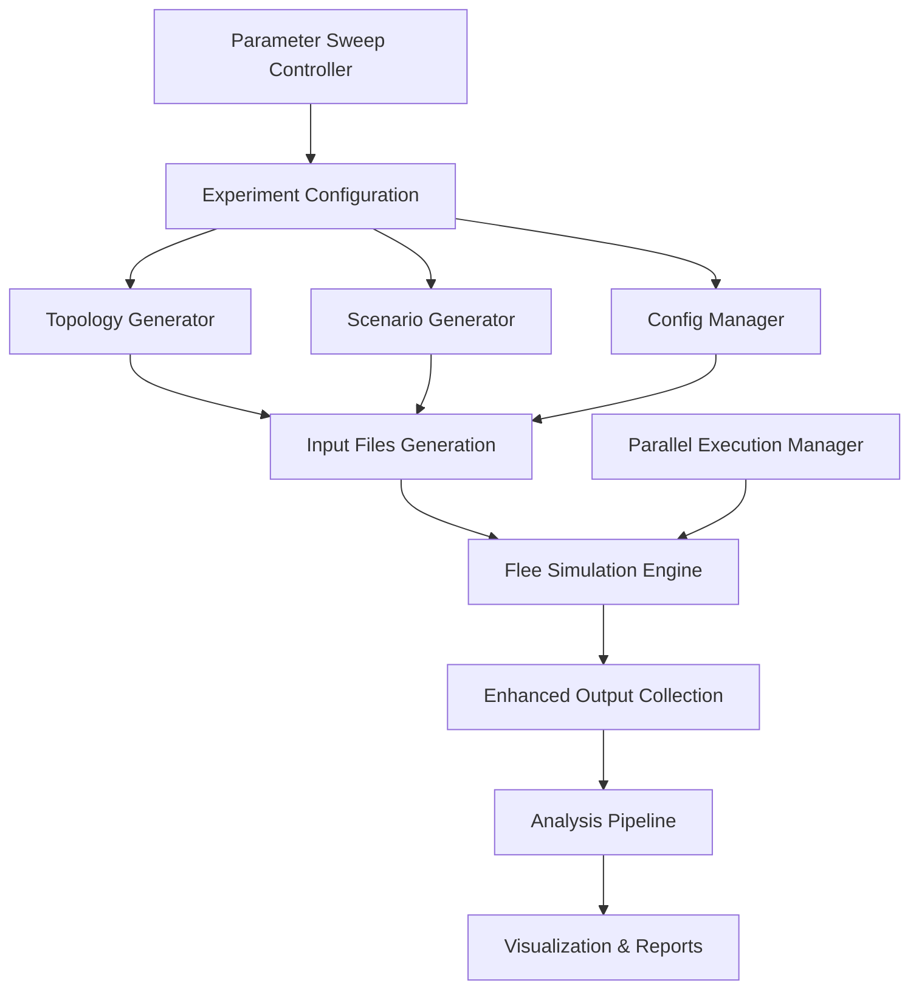

# Design Document

## Overview

The Dual Process Experiments framework is designed to systematically test how different cognitive modes (System 1 vs System 2 thinking) affect refugee movement patterns in the Flee simulation model. The framework consists of four main components: topology generators, scenario generators, experiment management, and analysis pipelines. The system integrates with the existing Flee codebase by extending the current dual-process decision-making capabilities and adding comprehensive experimental infrastructure.

## Architecture

### High-Level Architecture



### Directory Structure

The framework follows a modular structure that separates concerns and enables easy extension:

```
flee_dual_process/
├── topologies/           # Generated network structures
│   ├── linear/          # Chain topologies
│   ├── star/            # Hub-and-spoke networks
│   ├── tree/            # Hierarchical branching
│   └── grid/            # Rectangular grids
├── scenarios/           # Conflict pattern definitions
│   ├── baseline/        # Standard scenarios
│   ├── spike_conflict/  # Sudden onset conflicts
│   ├── gradual_conflict/# Escalating conflicts
│   └── cascading_conflict/ # Spreading conflicts
├── configs/             # Experimental configurations
│   ├── cognitive_modes/ # S1/S2/Dual settings
│   └── parameter_sweeps/# Systematic variations
├── scripts/             # Core framework code
│   ├── generate_inputs.py
│   ├── run_experiments.py
│   └── analyze_results.py
└── results/             # Auto-generated outputs
    └── [experiment_dirs]/
```

## Components and Interfaces

### 1. Topology Generator Module

**File**: `scripts/topology_generator.py`

The topology generator creates standardized network structures for testing different spatial configurations of refugee movement.

**Core Classes**:
```python
class TopologyGenerator:
    def __init__(self, base_config: dict)
    def generate_linear(self, n_nodes: int, segment_distance: float, 
                       start_pop: int, pop_decay: float) -> Tuple[str, str]
    def generate_star(self, n_camps: int, hub_pop: int, 
                     camp_capacity: int, radius: float) -> Tuple[str, str]
    def generate_tree(self, branching_factor: int, depth: int, 
                     root_pop: int) -> Tuple[str, str]
    def generate_grid(self, rows: int, cols: int, cell_distance: float, 
                     pop_distribution: str) -> Tuple[str, str]
    def _write_locations_csv(self, locations: List[dict], filepath: str)
    def _write_routes_csv(self, routes: List[dict], filepath: str)
```

**Integration Points**:
- Outputs standard Flee CSV formats (locations.csv, routes.csv)
- Validates topology connectivity and population distributions
- Supports parameterizable node properties (capacity, population, coordinates)

### 2. Scenario Generator Module

**File**: `scripts/scenario_generator.py`

Generates conflict patterns that trigger different cognitive responses in agents.

**Core Classes**:
```python
class ConflictScenarioGenerator:
    def __init__(self, topology_file: str)
    def generate_spike_conflict(self, origin: str, start_day: int, 
                               peak_intensity: float) -> str
    def generate_gradual_conflict(self, origin: str, start_day: int, 
                                 end_day: int, max_intensity: float) -> str
    def generate_cascading_conflict(self, origin: str, start_day: int, 
                                   spread_rate: float, max_intensity: float) -> str
    def generate_oscillating_conflict(self, origin: str, start_day: int, 
                                     period: int, amplitude: float) -> str
    def _write_conflicts_csv(self, conflicts: dict, filepath: str)
```

**Scenario Types**:
- **Spike**: Sudden high-intensity conflict at origin (tests System 1 rapid response)
- **Gradual**: Linear escalation over time (tests System 2 planning capabilities)
- **Cascading**: Conflict spreads through network (tests social connectivity effects)
- **Oscillating**: Cyclical intensity variations (tests adaptation patterns)

### 3. Configuration Management Module

**File**: `scripts/config_manager.py`

Manages experimental configurations and parameter sweeps.

**Core Classes**:
```python
class ConfigurationManager:
    def __init__(self, base_template: dict)
    def create_cognitive_config(self, mode: str, parameters: dict) -> dict
    def generate_parameter_sweep(self, base_config: dict, 
                                parameter: str, values: List) -> List[dict]
    def create_simsetting_yml(self, config: dict, output_path: str)
    def validate_configuration(self, config: dict) -> bool
```

**Cognitive Mode Configurations**:
```python
COGNITIVE_MODES = {
    's1_only': {
        'two_system_decision_making': False,
        'awareness_level': 1,
        'weight_softening': 0.5,
    },
    's2_disconnected': {
        'two_system_decision_making': True,
        'average_social_connectivity': 0.0,
        'awareness_level': 3,
    },
    's2_full': {
        'two_system_decision_making': True,
        'average_social_connectivity': 8.0,
        'awareness_level': 3,
    },
    'dual_process': {
        'two_system_decision_making': True,
        'average_social_connectivity': 3.0,
        'conflict_threshold': 0.6,
        'recovery_period_max': 30,
    }
}
```

### 4. Experiment Execution Module

**File**: `scripts/experiment_runner.py`

Orchestrates experiment execution with parallel processing and error handling.

**Core Classes**:
```python
class ExperimentRunner:
    def __init__(self, max_parallel: int = 4)
    def run_single_experiment(self, experiment_config: dict) -> dict
    def run_parameter_sweep(self, sweep_config: dict) -> List[dict]
    def run_factorial_design(self, factors: dict) -> List[dict]
    def _setup_experiment_directory(self, experiment_id: str) -> str
    def _execute_flee_simulation(self, input_dir: str, output_dir: str) -> bool
    def _collect_experiment_metadata(self, experiment_config: dict) -> dict
```

**Execution Features**:
- Parallel experiment execution with configurable worker pools
- Automatic retry logic for failed experiments
- Progress tracking and logging
- Resource monitoring and throttling
- Experiment state persistence for resumability

### 5. Enhanced Flee Integration

**Modifications to existing Flee code**:

**flee/flee.py** - Enhanced Person class:
```python
class Person:
    # Additional attributes for cognitive tracking
    def __init__(self, location, attributes):
        # ... existing code ...
        self.cognitive_state = "S1"  # Track current cognitive mode
        self.decision_history = []   # Log decision factors
        self.system2_activations = 0 # Count S2 activations
        
    def log_decision(self, decision_type: str, factors: dict, time: int):
        """Log decision-making process for analysis"""
        self.decision_history.append({
            'time': time,
            'type': decision_type,
            'cognitive_state': self.cognitive_state,
            'factors': factors,
            'location': self.location.name if self.location else None
        })
```

**New output files**:
- `cognitive_states.csv`: Tracks S1/S2 state for each agent over time
- `decision_log.csv`: Records decision factors and reasoning processes
- `social_network.csv`: Logs social connectivity changes

### 6. Analysis Pipeline Module

**File**: `scripts/analysis_pipeline.py`

Processes experimental outputs and generates insights.

**Core Classes**:
```python
class AnalysisPipeline:
    def __init__(self, results_directory: str)
    def calculate_movement_metrics(self, experiment_dir: str) -> dict
    def analyze_cognitive_transitions(self, experiment_dir: str) -> dict
    def compare_cognitive_modes(self, experiment_dirs: List[str]) -> dict
    def generate_statistical_report(self, comparison_data: dict) -> str
    def create_visualizations(self, analysis_results: dict) -> List[str]
```

**Key Metrics**:
- **Movement Timing**: First move day, peak movement periods, settlement patterns
- **Distance Analysis**: Total distance by cognitive mode, route efficiency
- **Destination Distribution**: Entropy measures, camp concentration ratios
- **Cognitive Dynamics**: S1/S2 transition frequencies, activation triggers
- **Social Effects**: Connectivity impact on movement patterns

## Data Models

### Experiment Configuration Schema

```python
@dataclass
class ExperimentConfig:
    experiment_id: str
    topology_type: str
    topology_params: dict
    scenario_type: str
    scenario_params: dict
    cognitive_mode: str
    simulation_params: dict
    replications: int
    metadata: dict
```

### Analysis Results Schema

```python
@dataclass
class ExperimentResults:
    experiment_id: str
    metrics: dict
    cognitive_states: pd.DataFrame
    decision_log: pd.DataFrame
    movement_data: pd.DataFrame
    summary_statistics: dict
```

### Cognitive State Tracking Format

```csv
#day,agent_id,cognitive_state,location,connections,last_transition,decision_factors
0,1,S1,Town_A,0,0,"{""conflict_level"": 0.1, ""social_info"": false}"
1,1,S1,Town_A,0,0,"{""conflict_level"": 0.1, ""social_info"": false}"
30,1,S2,Town_A,3,30,"{""conflict_level"": 0.7, ""social_info"": true, ""recovery_period"": 5}"
```

## Error Handling

### Validation Framework

```python
class ValidationFramework:
    def validate_topology(self, locations_file: str, routes_file: str) -> bool
    def validate_scenario(self, conflicts_file: str, topology_files: Tuple[str, str]) -> bool
    def validate_configuration(self, config: dict) -> bool
    def validate_experiment_outputs(self, output_dir: str) -> bool
```

**Validation Checks**:
- Topology connectivity (no isolated nodes)
- Population/capacity consistency
- Conflict scenario temporal validity
- Configuration parameter ranges
- Output file completeness and format

### Error Recovery

- **Experiment Failures**: Automatic retry with exponential backoff
- **Resource Exhaustion**: Queue management and throttling
- **Data Corruption**: Checksum validation and backup restoration
- **Configuration Errors**: Pre-flight validation with detailed error messages

## Testing Strategy

### Unit Tests

**Test Coverage Areas**:
- Topology generation algorithms (connectivity, population distribution)
- Scenario generation (temporal patterns, intensity calculations)
- Configuration management (parameter validation, file generation)
- Analysis pipeline (metric calculations, statistical tests)

**Test Framework**:
```python
class TestTopologyGenerator(unittest.TestCase):
    def test_linear_topology_connectivity(self)
    def test_star_topology_distances(self)
    def test_grid_topology_population_distribution(self)
    
class TestScenarioGenerator(unittest.TestCase):
    def test_spike_conflict_timing(self)
    def test_cascading_conflict_spread(self)
    
class TestAnalysisPipeline(unittest.TestCase):
    def test_movement_metric_calculations(self)
    def test_cognitive_state_analysis(self)
```

### Integration Tests

**End-to-End Workflows**:
- Complete experiment pipeline (generate → run → analyze)
- Parameter sweep execution with multiple topologies
- Cognitive mode comparison across scenarios
- Parallel execution stability under load

### Performance Tests

**Benchmarking Targets**:
- Topology generation speed (< 1 second for 100-node networks)
- Experiment execution throughput (target: 4 parallel simulations)
- Analysis pipeline processing time (< 30 seconds per experiment)
- Memory usage during large parameter sweeps

## Implementation Considerations

### Flee Integration Strategy

The framework integrates with Flee through:
1. **Configuration Extension**: Extends existing simsetting.yml format
2. **Output Augmentation**: Adds new CSV outputs without modifying existing ones
3. **Code Injection**: Minimal modifications to core Flee classes
4. **Plugin Architecture**: Framework can be used independently of core Flee development

### Scalability Design

- **Modular Architecture**: Each component can be scaled independently
- **Parallel Processing**: Experiment execution uses multiprocessing pools
- **Memory Management**: Streaming analysis for large datasets
- **Storage Optimization**: Compressed output formats for large parameter sweeps

### Extensibility Points

- **New Topologies**: Plugin interface for custom topology generators
- **Additional Scenarios**: Template system for new conflict patterns
- **Custom Metrics**: Extensible analysis pipeline with plugin support
- **Visualization Backends**: Support for multiple plotting libraries (matplotlib, plotly, etc.)

This design provides a comprehensive framework for systematic testing of dual-process theory in refugee movement simulations while maintaining compatibility with the existing Flee ecosystem.