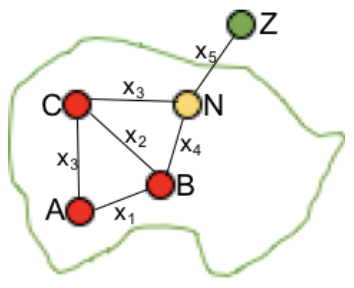
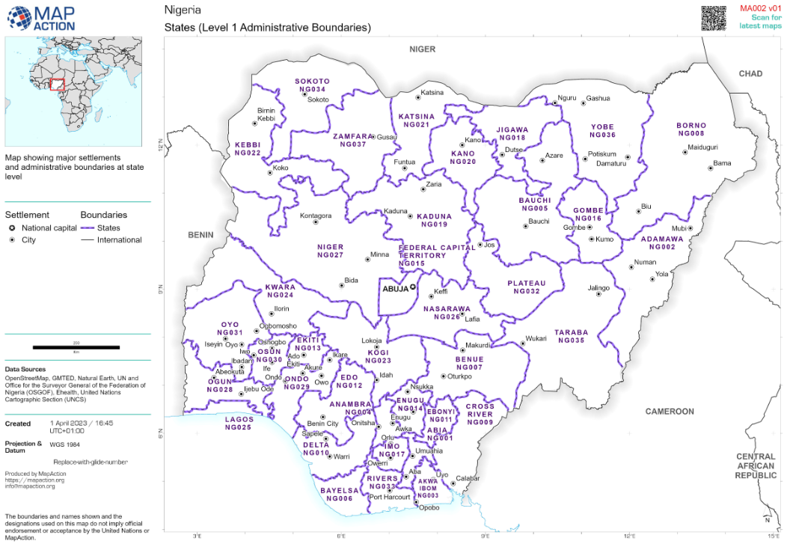

# Building a location graph

The location graph is an essential part of the Flee simulation, and can be constructed in three different ways:
* Location-based
* Region-based
* Grid-based

## Location based location graph construction

In location-based representations, all major settlements are individually represented, if they exceed a population threshold (e.g. 10,000). Conflict locations may also be prsent only if they exceed a certain population threshold, or all of them could be included.

### Obtaining conflict events
Typically, in this case one can use the location property of ACLED events directly.

### Advantages

* Fine-grained nature allows for detailed recording and definition of conflict events.
* Route planning is intuitive and relatively simply.

### Disadvantages

* Identifying all major settlements and their populations can be difficult.
* Clusters of locations can cause agents to swarm around them.
* Fine-grained nature can lead to sensitive simulation outputs.
       
## Region based location graph construction (1st, 2nd, or 3rd Admin levels)

Region-based location graphs contain one location per administrative region (usually on the admin 1 or admin 2 levels). Routes between locations are calculated by picking 
the centre of the largest settlement in each region, and then calculating the paths between those settlements.

Typically all relevant regions are included in the graph, irrespective of their population.

*Map of Nigeria at the admin 1 level, featuring main settlements as well. This is a good example of how Nigeria could be represented as a region-based location graph, although the routes between the cities are not shown here.*

### Obtaining conflict events
In this approach, we first filter ACLED data based on the desired admin level. ACLED data usually has four columns for locations levels: 
* admin1    
* admin2    
* admin3    
* Location
For the first three levels, we filter the dataset and select the first date these locations had conflict with over 1 fatality. The result will be the list of locations at the desired admin level. To find the coordinate of these locations, we use the coordinates of the largest cities in the region. In terms of the population, we use the total number of population of each admin level.
For each region (Admin level), if we had a town with the population more than a threshold, first we subtract that population from its region population and then add it to the locations.csv as a town location type.
For route construction, we use the ORS tools plugin in QGIS and then once we have the results, we prune the list of the routes.

### Setting conflict values

If a conflict occurs in a region, then the conflict value should be set higher than 0.0. The maximum is 1.0, and it's up to the user to define how to categorize different conflict intensities across this scale.

### Advantages

* Complete representation of the country.
* Abstraction reduces spatial sensitivity of the simulation runs.

### Disadvantages

* Routes between regions may be unrealistic if the regions feature multiple major settlements.
* Regions may have arbitrary sizes and shapes, introducing erratic properties in simulations.
* Still unclear how to define conflict intensities, e.g. for small events.

## Grid-based location graph construction

To be written.
