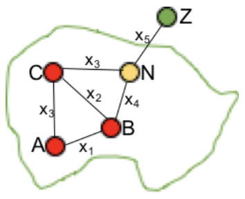
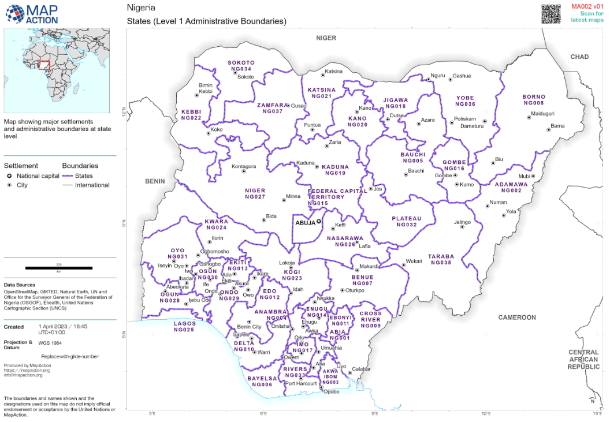
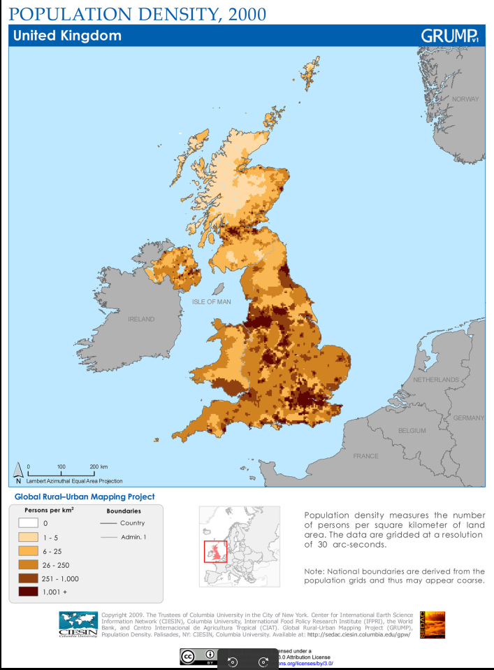

# Location types

The geography of a Flee simulation is represented as a **network graph** — a set of locations (nodes) connected by routes (links). There are three main approaches to constructing this graph.

---

## Location-based graphs

In a location-based graph, each major settlement is represented individually, provided it exceeds a population threshold (e.g. 10,000 people). Conflict locations may be included regardless of population.

**When to use:** when you need fine-grained spatial detail and have good data on individual settlements.

**How to get conflict events:** use ACLED event locations directly as conflict nodes.

### Advantages
- Fine-grained — allows detailed recording of conflict events at specific places
- Route planning between locations is intuitive

### Disadvantages
- Identifying all major settlements and their populations can be time-consuming
- Clusters of nearby locations can cause agents to concentrate artificially
- Fine spatial detail can make simulation outputs sensitive to small input changes

---

## Region-based graphs (admin level 1, 2, or 3)

In a region-based graph, each administrative region (e.g. province or district) is represented by a single node. The position of the node is typically the centre of the largest settlement in that region. Routes connect these representative points.

*A region-based representation of Nigeria at admin level 1. Routes between regions are not shown, but would connect the representative cities.*

All relevant regions are usually included regardless of population.

**When to use:** when you want complete geographic coverage with reduced sensitivity to small-scale variation.

**How to get conflict events:** filter ACLED data by admin level. For levels 1–3, identify the first date each region experienced conflict with more than one fatality. Use the coordinates of the largest city in the region. If a town within the region exceeds a population threshold, it can be added separately and its population subtracted from the region total.

**Setting conflict values:** if a conflict event occurred in a region, the conflict value should be greater than 0.0. The maximum is 1.0; you define the scale that maps conflict intensity to this range.

### Advantages
- Complete country coverage with no gaps
- Abstraction reduces spatial sensitivity of results

### Disadvantages
- Routes between regions may be unrealistic if regions contain multiple major settlements
- Region sizes and shapes can be arbitrary, introducing inconsistencies
- Conflict intensity scaling across the 0–1 range requires careful judgement

---

## Grid-based graphs

In a grid-based graph, the country is divided into a regular grid. Each cell with a population above a threshold becomes a node. Conflict events from ACLED are mapped to the grid cells where they occurred.

*An example population grid. Each cell above a population threshold becomes a node in the graph. Source: Columbia University.*

**How to construct:**

1. Obtain grid-based population data (e.g. from WorldPop or similar)
2. Set a population threshold per cell for inclusion as a node
3. Obtain ACLED conflict data and map events to grid cells
4. Set a (lower) population threshold for conflict cells
5. Map conflict events to `conflicts.csv` using grid cell IDs
6. Generate routes between cell centres (straight-line distance or routing API)

### Advantages
- All densely populated areas are included automatically
- Grid-based population data is relatively reliable
- Consistent level of spatial detail across the whole area

### Disadvantages
- Default Flee movement rules are designed for location/region graphs and may not transfer well — new rule sets may be needed
- Obstacles (rivers, mountains) within a cell create ambiguity
- Routes between cells may need to be pruned if physical barriers exist between them

---

## Choosing an approach

| Approach | Best for | Main trade-off |
|----------|----------|----------------|
| Location-based | High-detail studies of specific corridors | More data work; spatially sensitive |
| Region-based | Country-scale studies, ensemble runs | Abstraction may hide local dynamics |
| Grid-based | Large areas with sparse settlement data | Requires new movement rule tuning |
