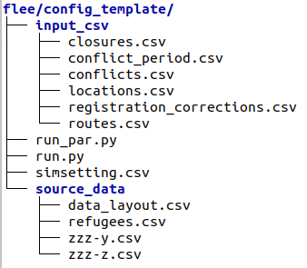

# Conflict use case

This section guides you through building and running a conflict displacement scenario with Flee.

## What you will build

A conflict scenario consists of:

- Input CSV files describing the geography and conflict schedule
- Validation data for comparing simulation output to real-world figures
- A `simsetting.yml` configuration file

All of these live in a directory called a **config** (configuration), structured as:

```
<scenario_name>/
├── input_csv/
│   ├── locations.csv
│   ├── routes.csv
│   ├── conflicts.csv
│   ├── closures.csv      (optional)
│   └── ...
├── source_data/          (validation data)
│   ├── refugees.csv
│   ├── data_layout.csv
│   └── <country>-<camp>.csv  (one per camp)
└── simsetting.yml
```



## Data sources

Before building a scenario you will need data from several sources:

| Source | What it provides |
|--------|-----------------|
| [ACLED](https://acleddata.com/) | Conflict event locations and dates |
| [UNHCR data portal](https://data2.unhcr.org/en/situations) | Camp locations and registered refugee counts |
| [CityPopulation](https://www.citypopulation.de/) | Population figures for locations |
| [OpenStreetMap](https://www.openstreetmap.org/) | Geographic routing and distances |

See [Data sources](data-sources.md) for details on obtaining each.

## Pages in this section

- **[Data sources](data-sources.md)** — where to get conflict, population, and camp data
- **[Building locations.csv](locations.md)** — define all locations in the simulation
- **[Building routes.csv](routes.md)** — define connections between locations
- **[Conflict schedule](conflict-schedule.md)** — define which locations have conflict on which days
- **[Camp data](camps.md)** — set camp capacities and validation counts
- **[Validation data](validation-data.md)** — format validation files for comparison
- **[Input file generator](input-file-generator.md)** — automate input file creation using scripts

## Pre-built examples

Several pre-built conflict scenarios are included in the Flee repository under `conflict_input/`:

- `burundi/`, `car/`, `ethiopia/`, `mali/`, `ssudan/`, `syria/`

These are good starting points for understanding the required file structure before building your own.
