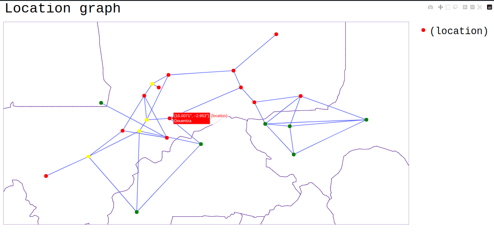
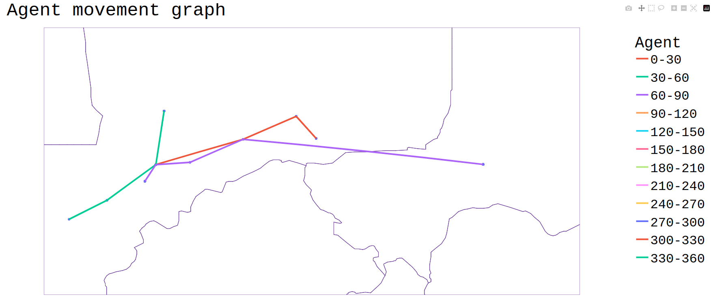

# Building scenarios with FabFlee

FabFlee automates the construction, execution, and analysis of Flee simulations. This page covers the scenario directory structure, automated construction commands, and post-processing tools.

---

## Scenario directory structure

All scenario config directories live in:
```
~/FabSim3/plugins/FabFlee/config_files/
```

A single-run scenario has this structure:

```
config_files/<scenario_name>/
├── input_csv/
│   ├── locations.csv
│   ├── routes.csv
│   ├── closures.csv
│   └── conflicts.csv              # conflict scenarios only
│   └── flood_level.csv            # DFlee scenarios only
│   └── region_attributes_IPC.csv  # optional food security
├── source_data/                   # validation data (optional)
│   ├── refugees.csv
│   ├── data_layout.csv
│   └── <country-camp>.csv
└── simsetting.yml
```

### Ensemble structure (SWEEP)

For ensemble or parameter sweep runs, add a `SWEEP/` directory. Each subdirectory is one independent run; any files missing from a variant are inherited from the base level:

```
config_files/<scenario_name>/
├── SWEEP/
│   ├── variant1/
│   │   ├── input_csv/
│   │   └── simsetting.yml
│   ├── variant2/
│   └── ...
└── (base files shared by all variants)
```

### Multiscale structure

Multiscale scenarios have separate input and validation files for macro and micro models:

```
config_files/<scenario_name>/
├── input_files_0/             # Macro model
│   ├── locations-0.csv
│   ├── routes-0.csv
│   ├── closures-0.csv
│   ├── coupled_locations.csv
│   └── conflicts-0.csv
├── input_files_1/             # Micro model
│   └── ...
├── source_data_0/             # Macro validation
└── source_data_1/             # Micro validation
```

---

## Automated conflict scenario construction

FabFlee provides commands to automate building a new conflict scenario from data sources.

### Step 1 — Create a new conflict instance

```sh
fabsim localhost new_conflict:<conflict_name>
```

This creates the directory structure and placeholder files in `config_files/<conflict_name>/`.

### Step 2 — Extract conflict zones from ACLED

Download ACLED data from [acleddata.com/data-export-tool](https://acleddata.com/data-export-tool/), rename it to `acled.csv`, and place it in `config_files/<conflict_name>/`.

!!! note
    A school or institutional email address is required to access ACLED resources.

Then run:

```sh
fabsim localhost process_acled:<conflict_name>,<DD-MM-YYYY>,<filter>,<admin_level>
```

| Argument | Description |
|----------|-------------|
| `conflict_name` | Name of the directory containing `acled.csv` |
| `DD-MM-YYYY` | Start date for conflict_date calculation |
| `filter` | `earliest` — keep first occurrence per location; `fatalities` — keep highest-fatality occurrence |
| `admin_level` | `admin1`, `admin2`, `admin3`, or `location` |

Example for Mali:

```sh
fabsim localhost process_acled:mali,01-08-2017,earliest,location
```

This produces `input_csv/locations.csv` in the conflict directory.

### Step 3 — Add population data (CityGraph)

1. Obtain an [OpenRouteService API key](https://openrouteservice.org/dev/#/signup)
2. Download [CityGraph](https://github.com/qusaizakir/CityGraph/releases) and extract it
3. Add to `machines_FabFlee_user.yml` under `localhost:`:

```yaml
localhost:
  cityGraph_location: "/path/to/citygraph"
  cityGraph_API_KEY: "your-api-key"
  cityGraph_COUNTRY_CODE: ""
  cityGraph_POPULATION_LIMIT: ""
  cityGraph_CITIES_LIMIT: ""
```

4. Run:

```sh
fabsim localhost add_population:<conflict_name>
```

This populates the population column in `locations.csv`.

### Step 4 — Refinement commands

After initial construction, use these commands to modify the scenario:

| Action | Command |
|--------|---------|
| Change camp capacity | `fabsim localhost change_capacities:<camp>=<cap>(,<camp2>=<cap2>)` |
| Add a location | `fabsim localhost add_camp:<name>,<region>,<country>,<lat>,<lon>` |
| Delete a location | `fabsim localhost delete_location:<name>` |
| Close a camp | `fabsim localhost close_camp:<name>,<country>,<start>,<end>` |
| Close a border | `fabsim localhost close_border:<country1>,<country2>,<start>,<end>` |
| Forced redirection | `fabsim localhost redirect:<src>,<dst>,<start>,<end>` |
| Change route distance | `fabsim localhost change_distance:<name1>,<name2>,<distance>` |
| Add a new route | `fabsim localhost add_new_link:<name1>,<name2>,<distance>` |
| Find max refugee count | `fabsim localhost find_capacity:<csv_name>` |

---

## Validation

### Running the autovalidator

Run the full validation suite across all built-in scenarios:

```sh
fabsim <machine_name> validate_flee:flee3_validation,cores=4
```

For the complete suite (recommended on HPC):

```sh
fabsim <machine_name> validate_flee:cores=64
```

Returns an averaged relative difference across all runs. Supports `replicas=<n>` and `PJ=true` flags.

Re-run post-processing on previously computed results:

```sh
fabsim localhost validate_flee_output:<results_dir>
```

---

## Visualisation

### Plot location graph

```sh
fabsim localhost plot_flee_links:<config_name>
```

This opens a browser visualisation of the location network. Locations are coloured by type.

<p align="center">
    
</p>

### Plot individual agent movements

```sh
fabsim localhost plot_flee_agents:<results_dir>,agentid=<id>,proc=<rank>
```

Requires `log_levels.agent` ≥ 1 in `simsetting.yml`. Example:

```sh
fabsim localhost plot_flee_agents:mali2012_localhost_1,agentid=11000
```

<p align="center">
    
</p>

---

## Profiling parallel simulations

Add `profile=True` to any `pflee` command to generate a trace:

```sh
fabsim localhost pflee:mali2012,simulation_period=50,profile=True
```

After fetching results, visualise the trace:

```sh
fabsim localhost plot_flee_profile:<results_dir>,profiler=gprof2dot
# or
fabsim localhost plot_flee_profile:<results_dir>,profiler=snakeviz
```

Requires `graphviz` (and `snakeviz` if chosen).

---

## Pre-built scenarios

| Scenario | Type | Description |
|----------|------|-------------|
| `mali2012` | Conflict | 2012 Northern Mali conflict |
| `ethiopia` | Conflict | Ethiopia conflict (ensemble validation example) |
| `dflee_test` | DFlee | Basic flood scenario |
| `dflee_test_laura` | DFlee | Flood scenario with forecasting enabled |

---

## See also

- [Conflict input files](../conflict/index.md) — building conflict input data from scratch
- [DFlee data files](../dflee/data-files.md) — flood input data format
- [Running locally with FabFlee](running-local.md) — run commands
- [HPC / supercomputer](hpc.md) — run on a remote machine
