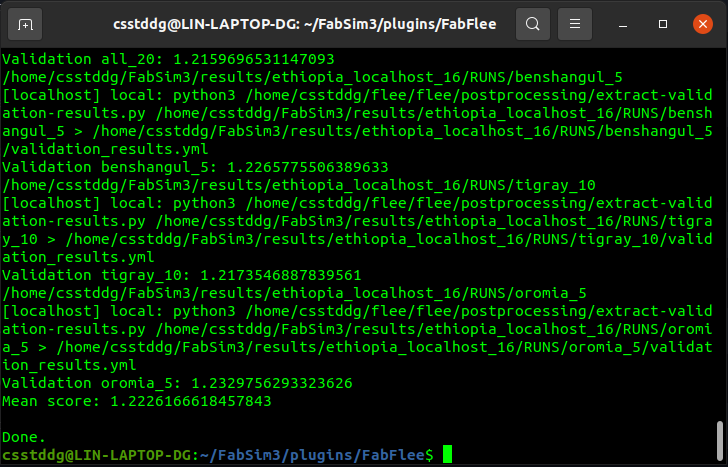

# Ensemble output validation (VVP3)

FabFlee supports the **Verification, Validation and Propagation pattern 3 (VVP3)** — an ensemble validation approach that runs multiple simulations and produces a compound accuracy score across all of them.

This is useful for:
- Validating forecasts that use different conflict progression assumptions
- Quantifying how much stochastic variability affects results
- Producing confidence intervals across simulation ensembles

---

## How VVP3 works

VVP3 applies a validation function to each run in an ensemble, then aggregates the scores into a compound metric. In FabFlee:

1. `validate_flee` applies a per-simulation validation function
2. `validate_flee_output` runs VVP3 across an entire output directory

The **mean score** is the averaged relative difference between simulated camp arrivals and UNHCR-observed data:
- `0.0` = perfect match
- `1.0` = 50% wrong on average

---

## Step 1 — Run an ensemble

Prepare a scenario with a `SWEEP/` directory. For example, the built-in Ethiopia scenario:

```sh
fabsim localhost flee_ensemble:ethiopia,simulation_period=147
fabsim localhost fetch_results
```

Results will be in `~/FabSim3/results/ethiopia_localhost_16/RUNS/`.

---

## Step 2 — Run validation

```sh
fabsim localhost validate_flee_output:ethiopia_localhost_16
```

This prints per-run and aggregate scores. Example output:



---

## Step 3 — Ensemble with replicas

To account for Flee's non-determinism, run replicas and validate:

```sh
fabsim localhost flee_ensemble:ethiopia,simulation_period=147,replicas=5
fabsim localhost fetch_results
fabsim localhost validate_flee_output:ethiopia_localhost_16
```

Each SWEEP variant will have 5 replicas, and the validation score is averaged across all of them.

---

## Validating multiple conflict scenarios

To validate an ensemble covering multiple different conflict scenarios at once:

```sh
fabsim localhost validate_flee_output:<results_dir>
```

The `data_layout.csv` file in each scenario's `source_data/` directory controls which camp CSV files are compared.

---

## See also

- [Running locally with FabFlee](running-local.md) — how to run ensembles
- [Building scenarios](construction.md) — SWEEP directory structure
- [Validation data](../conflict/validation-data.md) — how to prepare source data for validation
