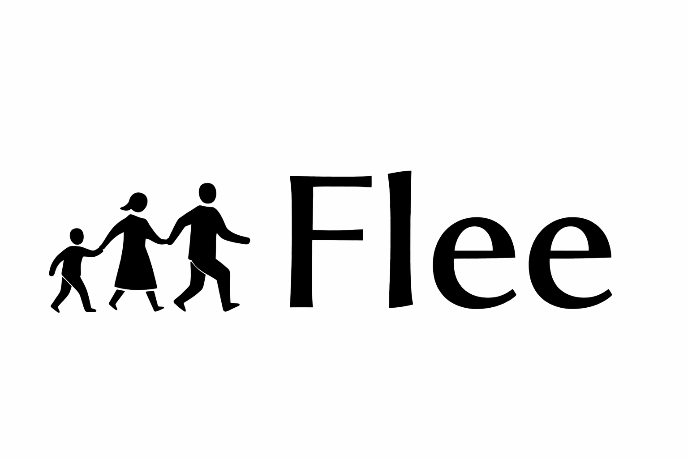

# **Simulation toolkit for the movement of individuals**

Flee is an agent-based modelling toolkit which is purpose-built for simulating the movement of individuals across geographical locations, released under a BSD 3-clause license.

Flee is currently used for modelling the movements of refugees and internally displaced persons (IDPs). It provides users with the ability to define and use their models through a relatively straightforward application programming interface (API). There are a range of functional tests to allow users to verify the consistency of the code results. FLEE also features a range of scripts to handle and convert data, as well as an automated plotting tool for output generated by the simulation.

The 3.0 version of Flee has been released in 2024, and as part of this release we have validated the model against 11 different historical conflicts. More information about this version of the code and the validation work can be found in our Journal of Computation Science publication: https://doi.org/10.1016/j.jocs.2024.102371 .

Flee is publicly available at: [https://github.com/djgroen/flee](https://github.com/djgroen/flee)  

