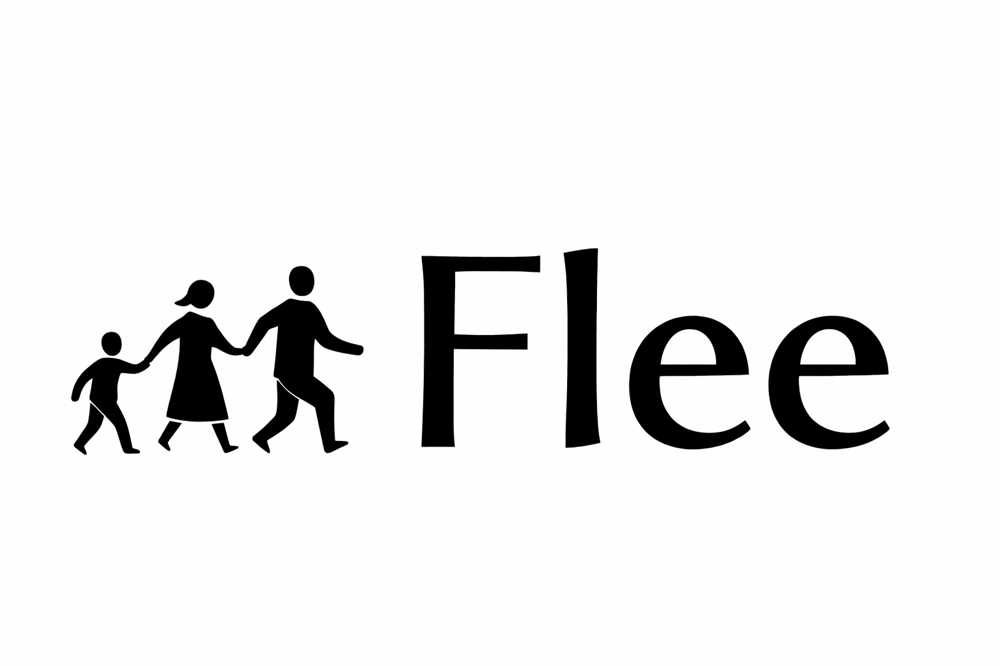

# Home

**flee** is an open-source agent-based modelling toolkit for simulating the movement of displaced people across geographical locations.

It is designed to be used by researchers, analysts, and humanitarian organisations to understand and forecast forced displacement — whether driven by armed conflict or natural disasters.

---

## What can flee do?

- Simulate thousands of individual agents (people) moving through a network of locations
- Model refugee and internally displaced person (IDP) movements during conflict situations
- Model displacement driven by natural disasters, such as floods — using the **DFlee** extension
- Run as a single simulation or as an ensemble of many simulations
- Scale to large parallel runs using MPI (via **pflee**) or to multiscale coupled models

---

## How is flee used?

flee is typically used in one of two ways:

1. **Directly** — by running Python scripts from the command line, using flee as a library
2. **Via FabFlee** — using the [FabSim3](https://fabsim3.readthedocs.io/) automation plugin to manage simulation workflows, run ensembles, and submit jobs to HPC systems

The documentation covers both approaches. If you are new to flee, start with the [getting started](getting-started/index.md) section.

---

## Two main use cases

| Use case | Description |
|----------|-------------|
| **Conflict displacement** | Simulates refugee movements during armed conflict, using ACLED conflict data and UNHCR validation data |
| **DFlee (disaster displacement)** | Simulates displacement driven by disasters such as flooding, using flood level data and food security indicators |

See [Conflict vs disaster use cases](concepts/conflict-vs-disaster.md) for more detail.

---

## Quick links

- [Installation](getting-started/installation.md)
- [Quick start](getting-started/quick-start.md)
- [How the model works](concepts/agent-based-model.md)
- [Building a conflict scenario](conflict/index.md)
- [DFlee disaster modelling](dflee/index.md)
- [Running with FabFlee](fabflee/index.md)
- [Full settings reference](running/settings-reference.md)
- [GitHub repository](https://github.com/djgroen/flee)

---

flee is released under a [BSD 3-clause licence](https://github.com/djgroen/flee/blob/master/LICENSE) and is publicly available at [https://github.com/djgroen/flee](https://github.com/djgroen/flee).

