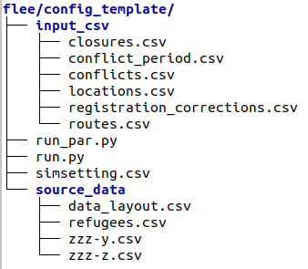

.. _construction:

Simulation instance construction
================================

This documentation details how to construct a conflict scenario for forced displacement simulation. Each conflict situation requires input data (in **input_csv** directory), validation data (in **source_data** directory) and execution scripts (**run.py**, **run_par.py** and **simsetting.csv**) as illustrated below:

To create input and validation data files, the following forced displacement databases are considered:

- the Armed Conflict Location and Event Data Project (ACLED, https://www.acleddata.com/data);
- the United Nations High Commissioner for Refugees database (UNHCR, https://data2.unhcr.org/en/situations);
- the population databases (e.g. https://www.citypopulation.de);
- the geospatial databases (e.g. https://www.openstreetmap.org or http://www.bing.com/maps).

  
Construct an input **locations.csv** file
--------------------------------------------

1. ACLED conflict locations extraction
~~~~~~~~~~~~~~~~~~~~~~~~~~~~~~~~~~~

The **ACLED** database provides conflict location data for forced displacement simulations. To obtain data on chosen conflict situation, complete the ACLED data export tool fields (https://acleddata.com/acleddatanew/data-export-tool/) as follows:
  - Provide dates of interest for conflict situation (i.e. From and To).
  - Select ``Event Type: Battle``.
  - Select ``Sub Event Type``
  
    - Armed clash, 
    - Attack, 
    - Government regains territory and 
    - Non-state actor overtakes territory.
    
  - Specify ``Region`` and ``Country`` of conflict situation choice.
  - Click on Export and Accept Terms of Use and Attribution Policy.
  - Click Export again and <name>.csv file exports to Downloads automatically.

The ACLED conflict data provides conflict locations to construct **locations.csv** input file for simulation purposes. After identifying conflict locations and producing **locations.csv**, the last column is filled with population data for conflict locations.

=====  =======  ========  ====  =====  ==============  ==============  ====================
name   region   country   lat   long   location_type   conflict_date   population/capacity 
-----  -------  --------  ----  -----  --------------  --------------  --------------------
 A       AA       ABC     xxx    xxx      conflict          xxx                xxx        
 B       BB       ABC     xxx    xxx      conflict          xxx                xxx          
 C       CC       ABC     xxx    xxx      conflict          xxx                xxx              
...      ...      ...     ...    ...         ...            ...                ...          
=====  =======  ========  ====  =====  ==============  ==============  ====================

2. UNHCR forced migrant counts and camp locations extraction
~~~~~~~~~~~~~~~~~~~~~~~~~~~~~~~~~~~~~~~~~~~~~~~~~~~~~~~~~

The **UNHCR** situations provides an overview of active situations worldwide that are facing forced displacement distress. To construct a new conflict situation:
  - Select an active (conflict) situation of interest from an interactive map and click to access data and documentation      
    relevant to a chosen conflict situation from https://data2.unhcr.org/en/situations.
  - Select a simulation period for conflict situation from ``Refugees and asylum-seekers from `chosen situation name` -       
    Total`` timeline, which also presents forced displacement counts for a chosen period.
  - Obtain total counts of forcibly displaced people by clicking JSON button of ``Refugees and asylum-seekers from `chosen       
    situation name` - Total`` section. 
  - Identify camps for each neighbouring country through ``Breakdown by Country`` section of the conflict situation.
  - Collect and save data for each camp (e.g. <country_name-camp_name>.csv).

Input camp names (i.e. destination locations) and their capacity into **locations.csv** file. Camp capacity is the highest number of forced migrants for each camp and obtained from individual camp CSV files that are set in **locations.csv**. For instance, CampZ.csv has the highest number of forcibly displaced people (18129) on 2015-09-30, which is the camp capacity for CampZ.

===========  =======
...          ...
-----------  -------
2015-03-31   11470
2015-06-02   12405
2015-07-24   12405
2015-08-31   11359
2015-09-30   18129
...          ...
===========  =======

3. Population data extraction
~~~~~~~~~~~~~~~~~~~~~~~~~~
Currently, the population figures for each location will need to be collected and written to the `population/capacity` column from www.citypopulation.de. After the population data has been collected for each location, input these population numbers in `locations.csv`, which can be then used for simulation execution.

Construct an input **routes.csv** file
--------------------------------------

Identified conflict zones and camps provide origin and destination locations. We connect these locations to represent how forcibly displaced people flee. We use  https://www.openstreetmap.org or http://www.bing.com/maps (or other mapping services) to connect conflict zones and camps, and add additional locations (if required) as a location type **town** to locations.csv as illustrated below:

=====  =======  ========  ====  =====  ==============  ==============  ====================
name   region   country   lat   long   location_type   conflict_date   population/capacity 
-----  -------  --------  ----  -----  --------------  --------------  --------------------
 A       AA       ABC     xxx    xxx      conflict          xxx                xxx        
 B       BB       ABC     xxx    xxx      conflict          xxx                xxx          
 C       CC       ABC     xxx    xxx      conflict          xxx                xxx          
 Z       ZZ       ZZZ     xxx    xxx        camp                               xxx       
 N       NN       ABC     xxx    xxx        town                                         
...      ...      ...     ...    ...         ...            ...                ...          
=====  =======  ========  ====  =====  ==============  ==============  ====================

Record distances between locations in **routes.csv** file for simulation using the following format:

======  ======  =============  ===================
name1   name2   distance[km]   forced_redirection
------  ------  -------------  -------------------
 A        B      x1      
 B        C      x2          
 A        C      x3           
 B        N      x4   
 C        N      x3                              
 N        Z      x5
 ...     ...     ...            
======  ======  =============  ===================

**forced_redirection** refers to redirection from source location (can be town or camp) to destination location (mainly camp) and source location indicated as forwarding_hub. The value of 0 indicates no redirection, 1 indicates redirection (from name2) to name1and 2 corresponds to redirection (from name1) to name2.

Define location and border closures in **closures.csv** file
------------------------------------------------------------
We identify location or border closure events and document them in **closures.csv** file:

=============  ======  ======  ==================  =================
closure_type   name1   name2   closure_start = 0   closure_end = -1  
-------------  ------  ------  ------------------  -----------------
   location      A       B            xxx	                xxx        
   country      ABC     ZZZ           xxx	                xxx      
     ...        ...     ...           ...                 ...
=============  ======  ======  ==================  =================
      
**closure_type** has 2 possible values: 

- **location** corresponding to camp or town closure and 
- **country** referring to border closure. 

**closure_start** and **closure_end** are given as integers, counting the number of days after the simulation start. The value of 0 indicates the start, while -1 indicates the end of the simulation.

Define a conflict period for a conflict situation
-------------------------------------------------

We define the simulation period of a confict situation using **conflict_period.csv** file, which has the following format:

==========  ==================
StartDate   YYYY-MM-DD
----------  ------------------
Length      simulation_period 
==========  ==================

Record conflict locations in **conflicts.csv** file
---------------------------------------------------

We create a **conflicts.csv** file to record conflict locations indicating the start of conflicts in the simulation execution (represented as 1):

=====  =====  ====  ====  ====  ====
#Day   name    A     B     C     Z
-----  -----  ----  ----  ----  ----
0      0      1     0     0     0
1      0      1     0     0     0
2      0      1     1     0     0
3      0      1     1     0     0
4      0      1     1     1     0
5      0      1     1     1     0
...    ...    ...   ...   ...   ...
=====  =====  ====  ====  ====  ====

Construct a network map for a conflict situation
------------------------------------------------

Construct an agent-based network map from **locations.csv** and **routes.csv** using https://carto.com.

.. image:: ../images/network.png
   :width: 200
   :align: center

Construct validation data
-------------------------

There are three CSV file formats required for validation of simulation outputs. CSV file containing total forced migrant counts **refugees.csv** comprises total counts of forcibly displaced people from ``Refugees and asylum-seekers from `chosen situation name` - Total`` JSON file and has the format as demonstrated:

===========  ====
    ...      ...  
-----------  ---- 
YYYY-MM-DD   xxx  
YYYY-MM-DD   xxx  
    ...      ...  
===========  ====

We obtain data for each camp using the format and label them as **country_name-camp_name.csv**:

===========  ====
    ...      ...  
-----------  ---- 
YYYY-MM-DD   xxx  
YYYY-MM-DD   xxx  
    ...      ...  
===========  ====

**data_layout.csv** contains camp names for each camp/destination locations:

===========  ============================
total        refugees.csv          
-----------  ---------------------------- 
camp_name1   country_name-camp_name1.csv  
camp_name2   country_name-camp_name2.csv  
...                     ...              
===========  ============================

